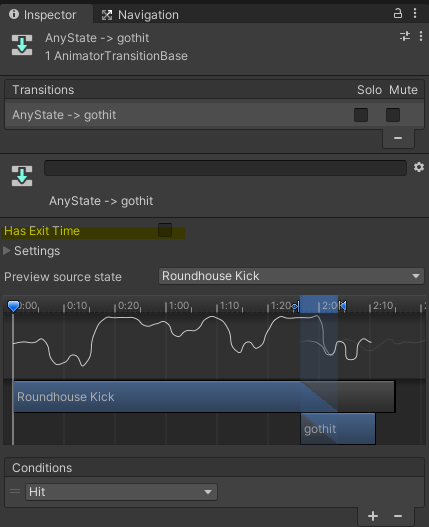

# Note

**1. Aimator**
NPC 에 인공지능을 부여하는 방법
1. 유한상태머신 finite state machine (FSM)


animator inspector 의 Has Exit Time
 - 컨디션의 parameter 가 조건을 달성했을 때 has exit time 이 체크 되어있으면 현재 모션을 끝까지 play 하고 다음 모션으로 넘어간다.


<br/>

**2. Find Function**
- All 'Find~' method search through all object in hierarchy, so it takes large time.
Not recommend using in the Update funcions.

<br/>

**3. Question mark (?) Usage**

- 게임 오브젝트가 Null 일 경우를 대비한 코딩
```cs
GameObject playerObject = GameObject.FindGameObjectWithTag("PLAYER");
if(playerObject != null)
{
    playerTr = playerObject.transform;
}
```
- 위 코드를 간결하게 '?' 를 사용해서 한 줄로 바꿀 수 있다.
```cs
playerTr = GameObject.FindGameObjectWithTag("PLAYER")?.GetComponent<Transform>();

```
<br/>

**4. Coroutine**
StartCoroutine(CheckState()); 
 - 추후에 개별적으로 coroutin 함수를 정지 할 수 있음.

StartCoroutine("ChekState"); 
 - 추후에 정지 못함
 - garbage에 데이터를 쌓음.


**5. Navigation**
 A*PathFinding 알고리즘을 사용해 최단거리 계산
- 네비게이션 시스템 (NavMesh) 을 사용.

Navigation tool:
1. 위치
    window -> Navigation.
<br/>

2. nav mesh agent
    position and rotate the object to the selected area.
<br/>

3. priority  
     특정한 지점으로 이동시 두 물체가 충돌했을 때 priority value에 따라 우선권을 갖는다.
<br/>

4. Auto Traverse Off Mesh Link
메쉬가 없는 부분을 지나가야할 때 링크를 시켜줌.
<br/>

5. Auto Repath
최단거리를 재계산 함.
    ex) 움직이는 장애물이 있을 경우.
<br/>

6. Area Mask
공간상의 마스크를 여러개로 분류하고
게임 오브젝트에게 이동가능한 매쉬를 run time 에서 추가 및 제거를 할 수 있음.
ex) 다리를 폭파시킨 뒤에 이동을 제한.

- 3d 오브젝트가 사라져도 초기 bake 한 마스크는 run time에서 사라지지 않기 때문에 이러한 방법을 사용.

<br/>

**6. agent movement**
- agent.SetDestination(playerTr.position); => use function
- agent.destination = playerTr.position;  => use property

<br/>

**7. Access Animator variable**
```cs
//When access to the parameters in the Animator controller.

anim.SetBool("key", true); 
//   => It searches every parameters in the Hash Table, which is quiet heavy.


//Instead,
private readonly int hashKey = Animator.StringToHash("IsTrace");
anim.SetBool(hashKey, true);
//    => Save the hash value into the Integer variable, and then call it.

