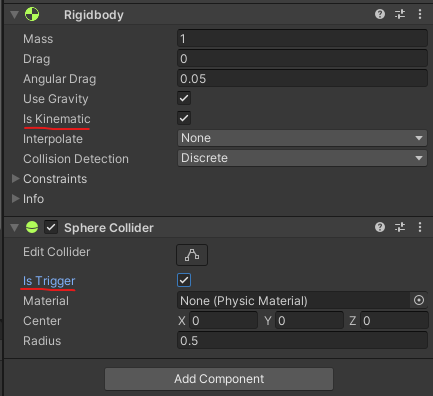
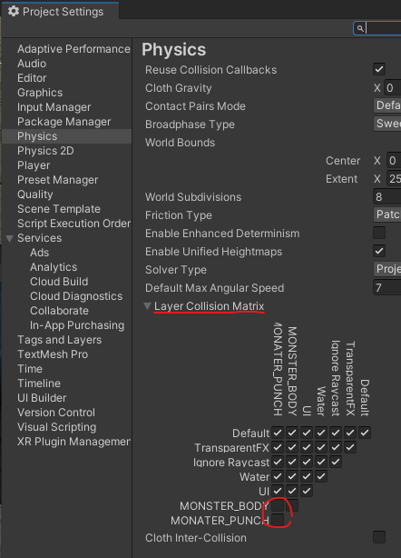
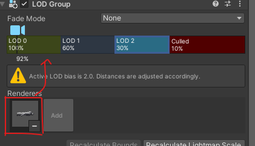
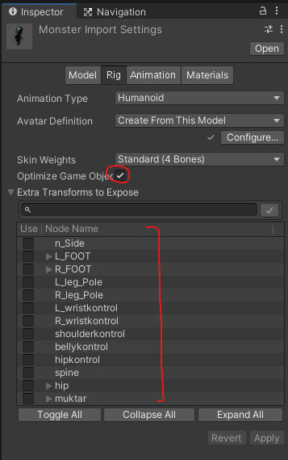

# Notes

**1. Collider and Rigidbody**
;
1. Is Kinematic
    - rigidboy componet의 물리 엔진을 사용하지않고 사용자가 지정한 엔진을 사용.
2. Is Trigger
    - 물체가 충돌하였을 경우 충돌대상을 통과.
    - onCollision이 아닌 onTrigger 함수를 실행.


**2. Is Trigger**
```
1. unchecked
    - Collision type
    - onCollisionEnter, Stay, Exit
2. checked
    - Collider type
    - onTriggerEnter, Stay, Exi

* onTriggerEnter 이 데이터가 더 가벼움.

```


**3. Layer**

If there are more than one collider in 3D object, 
unnecessary collision occur, which call callback function.

=> Set layer to each object, and uncheck Layer Collision Matrix.
;


**4. LOD - Level of Detail**

;
거리가 카메라로 부터
1. LOD 0 : 가까울 때. (high polygon)
2. LOD 1 : 중간일 때. (Middle polygon)
3. LOD 2 : 멀 때. (Low polygon)
4. Culled : 아주 멀 때 -> (disappear)

- Renderers 에는 다양한 object 등을 추가 할 수 있다.


**5. Skinned mesh renderer**
- 뼈대가 있는 component 는 skinned mesh renderer 컴포넨트가 자동으로 선택된다.
- mesh filter 없이 mesh를 가지고 있음.


**6. 3D 오브젝트의 관절 최적화**
- scene에 보이고 싶은 object를 체크. 나머지는 표시되지 않음. (퍼포먼스 향상)

;
단, prefab 만들기 전에 해야함.


<br/>


**7. 스테이지에 있는 모든 몬스터를 추출 하는 방법들**

1. 배열을 순회하며 모든 몬스터의 script를 search.
```cs
GameObject[] monsters = GameObject.FindGameObjectsWithTag("MONSTER");
foreach (GameObject monster in monsters)
{
    monster.GetComponent<MonsterCtrl>().YouWin();
}
```

<br/>

2. 메세지를 보내서 해당 함수를 실행시킴.
```cs
    monster.SendMessage("YouWin", SendMessageOptions.DontRequireReceiver); // YonWin 함수가 없을 경우 Dont Require Receiver -> return 값을 받지 않겠다.
```
<br/>

3. Deligate : 대리자, 함수를 저장할 수 있는 데이터 타입

 - PlayerCtrl.cs
```cs
public delegate void PlayerDieHandler(); -> 데이터 타입 명과 유형을 저장;
public static event PlayerDieHandler OnPlayerDie; -> OnPlayerDie 변수에 함수를 저장 가능.
```
 - MonsterCtrl.cs
```cs
void OnEnable() // script 가 활성화 될 때 마다 호출, 주로 이벤트를 연결할 때 사용
    {
        PlayerCtrl.OnPlayerDie += this.YouWin;
    }

//event는 스크립트가 사라져도 남아있기 때문에 비활성화 해주어야한다.
void OnDisable() //스크립트가 비 활성화 될 때 마다 호출
{
    PlayerCtrl.OnPlayerDie -= this.YouWin;
}
```
static : 
 - 메모리 제일 상단에 고정이된다. (프로그램이 시작 할 때 부터 종료 되기 전까지 항상)  
    -> 다른 스크립트에서 접근 할 수 있다.


<br/>

**8. Get components in children** 

1. Save in Array / parent 포함
```cs
 public Transform[] points;
 
 // void Start()
 points = GameObject.Find("objectName").GetComponentsInChildren<Transform>(); 

``` 
<br/>


2. Save in List / parent 미포함
```cs
 public List<Transform> points = new List<Transform>();

// void Start()
 Transfrom tr = GameObject.Find("objectName").transform;

 foreach(Transform _tr in tr)
 {
     points.Add(_tr);
 }
```
<br/>

3. Save in List / parent 포함
```cs
public List<Transform> points = new List<Transform>();

// void Start()
GameObject.Find("objectName").GetComponentsInChildren<Transform>(points);
``` 

<br/>
<br/>

**9. Resources folder**
- unity에 저장된폴더
- 게임 플레이 시 이 폴더는 씬에 업로드 됨.
- 이 폴더 안에 있는 데이터들에 접근 할 수 있다.

```cs
monsterPrefab = Resources.Load<GameObject>("monster");
```

<br/>

**10. Invoke**
Invoke(string methodName, float time)
- 해당 함수를 지정 시간 뒤에 호출

InvokeRepeating(string methodName, float time, flaot repeatRate)
- 해당 함수를 지정 시간 뒤에 지정 반복시간 만큼 반봄.

CancelInvoke("methodName");
- 해당 함수 invoke cancel


<br/>

**11. Singleton**
해당 클래스를 전역 클래스로 올림.(static)
다른 스크립트에서 접근 가능함.

```cs
public static GameManager instance = null;
//싱글톤 초기화
void Start(){
    if(instance == null)
    {
        instance = this;
        //scene이 바뀌어도 해당 스크립트를 가지고 있는 gameobject 는 사라지지 않음.
        DontDestroyOnLoad(this.gameObject); 
    }
    else
    {
        if(instance != this)
        {
            Destroy(this.gameObject);
        }
    }
    // 만약 instance가 null이 아니라면, 한번 호출 되었던 script라는 의미
    // Scene을 변경하는 과정에서 instance를 또 호출 하게 되는 경우를 대비해 제거.
}
```
script A 에서 변수를 스태틱으로 설정을 하면 
다른 script 에서 A.variableName 으로 해당 변수에 접근 할 수 있다.

<br/>

**12. 오브젝트 풀링**
게임 오브젝트들을 동시에 많이 instantiate / Destory 하면 프레임 드랍 현상이 발생함
- 미리 오브젝트들을 만들어 놓고 비활성화시킴.
    - 오브젝트가 필요할 때 활성화를 시킴.


    