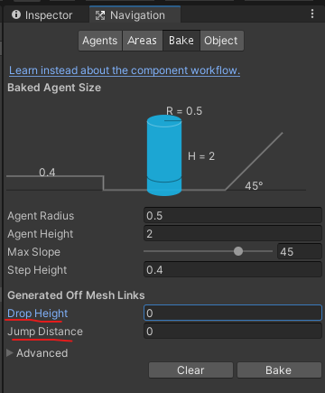

**1. 동적 Nav Mesh 인식**

######Nav Mesh Obstable
- game object에 이 component를 추가하면 몬스터가 해당 오브젝트를 장애물로 인식해 피해간다.
- 런타임 중 해당 object가 사라지면 몬스터가 그 부분을 피하지 않고 지나간다.
- 버그 : 장애물이 여러개 있고 장애물 사이에 미세한 틈이 있을 때 몬스터가 그 틈을 뚫고 들어오려고 함.
    - Carve mode : 런타임 상에서 mesh를 계속 갱신


**2. Mesh Link**
- Static : off mesh link generation 
    - 게임 오브젝트에 메쉬링크 선택

<br/>

- 네비게이션 툴에서 옵션값 조절
;

<br/> 

- 해당 오브젝트의 모든 면에 원이 생기고 연결됨. 
;

<br/> 

- 특정한 부분만 링크를 연결 하고 싶을 때
;
    
    - off mesh link conponent를 추가하고
    - Start / End 포인트를 선택하면

<br/>

- 특정한 부분만 링크됨.
;


<br/>

**3. Raycast**

<예시>
1. 지면에 발사 : 지면에서 점프를 했는지 공중에저 점프를 했는지 인식.
2. 레이싱: 차를 기준으로 위로 레이저 발사 : 레이저가 바닥에 닿으면 차가 전복했음을 인식.
3. 몬스터의 시야각을 인식할 때 이용.

```cs
Physics.Raycast(firePos.position, firePos.forward, out hit, 10.0f, 1<<6)
//(시작위치, 방향, 출력값, 거리, 6번레이어만)
```

<br/>

**4. Light mapping**
- draw call을 줄이기 위한 목적.
- 조명이 미치는 영향을 미리 texture로 만든 후 이미지를 사용하여 Render.
 (Global Illumination (GI), Direction Light, Shadow)
 ;

 - 라이트 맵에 포함 시키고 싶은 오브젝트의 static setting
  ;

<br/>
<br/>

 **5. Light Probe Group**
 - 욺직이는 오브젝트에게 빛을 입힐 수 있는 기능
 - 라이트 프로브를 여러개 만들어 빛을 저장한 뒤 리얼타임에서 오브젝트들에게 뿌려준다.
 ;
;
    - 노랑 구체가 probe


<br/>
<br/>

**6. Occlusion Culling**
- rendering 최적화 (가려진 물체를 제거)

culling 기법 종류
1. Frustum Culling
    - 화면 밖 부분을 rendering 하지 않는다
2. 카메라 거리에 의한 Culling
    - 거리가 멀리 있는 객체를 Culling (LOD)
3. Occulsion Culling
    - 가려진 물체를 Culling


```
**Static 종류**
Occluder Static : 다른 물체를 가릴 수 있다(앞에있는 물체에게 선택).
Occludee Static : 다른 물체에게 가려질 수 있다(뒤에 있는 물체에게 선택).
- 둘다 선택 가능(큰 물체에게 가려지고 작은 물체를 가릴 경우).

- occlusion culling이 잠시 필요 없을 경우 main camera의 occlusion culling deative.
- occlusion area: Occlusion Culling은 직사각형으로 bake 하기 때문에 필요한 부분만 area로 설정하여 bake 할 수 있다.
```

**7. UI**
- Legacy UI(IMGUI) :::: 테스트 용
- UnityUI :::: 주로 사용
- UI Builder(UI toolkit) :::: 계속 개발중

```
Draw Call increased depends on the number of textures.
    -> To reduce Draw Call, put all UI textures into one texture image. (Atlas Map)
```

Canvas:
- Rect Transform: 캔버스의 크기는 화면 크기에 맞춰서 유동적으로 변형함.

<br/>

######Component
- Canvas
;
    - Screen Space - Overlay: 맨 앞에 있음.
    - Screen Space -CCamer: UI만 별도로 rendering
    - World Space: 3차원 공간 안에서 다른 물체에 의해 가려질 수 있음.(좌표가 있음)

<br/>

- Canvas Scaler
;
    - Constant Pixel Size: 화면이 커져도 UI는 그대로
    - Scale With Screen Size: 화면이 커지면 UI도 같이 커짐