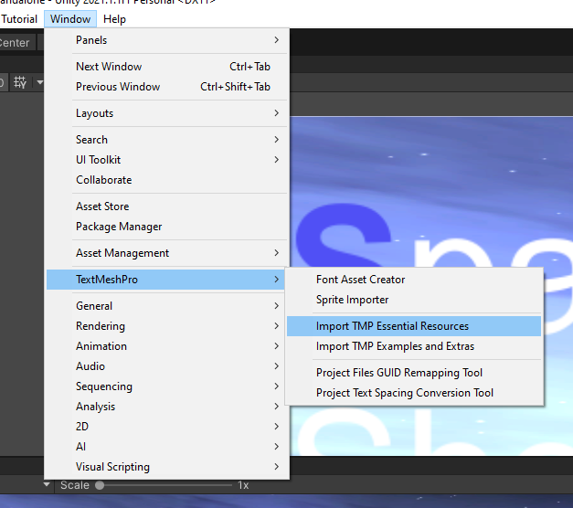
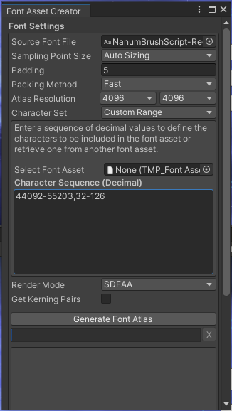
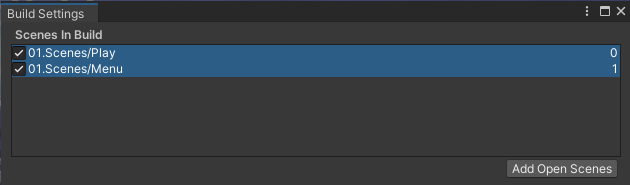
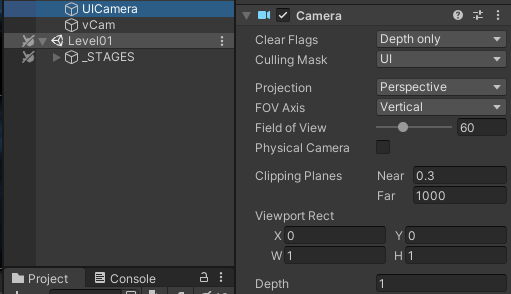
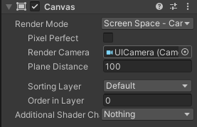

**1. TextMeshPro** 
- 선명한 text
;

<br/>


- 한글 폰트 추가.
;

    44092-55203: 한글 범위
    32-126 알파벳 + 숫자 범위


**2. Scene**
- add Scene
;

<br/>


######load scene with button
```cs
using UnityEngine.SceneManagement;

public class UIManager : MonoBehaviour
{
    public void OnStartGameClick()
    {
        SceneManager.LoadScene("Level01", LoadSceneMode.Single);
        //single : 단일 모드로 로드
        SceneManager.LoadScene("Play", LoadSceneMode.Additive);
        //additive : 현재 열려있는 Scene에 추가로 새로운 Scene을 병합
    }
}
```
<br/>
<br/>
<br/>

**3. Canvas UI Camera**

<UI 영역을 게임 영역과 분리 후 렌더링 상에서 병합하기.>
######UICamera
;
- create new Camera
- set Clear Flags as Depth only
- set Culling mask as UI
- remove AudioListener(only need one listener in game)

<br/>


######Canvas Setting
;
- drag UI Camera into Render Camera.


**4. Explosion Effect**
1. sphere collider를 순간적으로 씌워서 반경 내 오브젝트들을 추출
    ```cs
    void ExpBox()
    {
        Collider[] colls = Physics.OverlapSphere(hit.point, 5.0f, 1<<6);

        ...
        //foreach
        coll.GetComponent<Rigidbody>()?.AddExplosionForce(횡폭발력, 폭발 원점, 반경, 종 폭발력);
    }
    ```

<br/>


**5. Rotation Effect**
```cs
Quaternion.Slerp(tr.rotation, rot, Time.deltaTime * damping);
// slerp : 감속하며 회전.
Quaternion.lerp(tr.rotation, rot, Time.deltaTime * damping);
// lerp : 일정한 속도로 회전
```

<br/>

**6. Movement Effect**
```cs
(movePos - tr.position).sqrMagnitude >= 0.2f * 0.2f
// 두 포인트 사이의 거리의 제곱근을 return(루트 연산을 제외하기 위해 사용)
```

<br/>

**7. if and endif**

    ```cs
    #if UNITY_EDITOR
    if(Input.GetMouseButtonDown(0))
    {
        if(Physics.Raycast(ray, out hit, 100.0f, 1<<8))
        {
            movePos = hit.point;
        }
    }
    #endif
    ```
- #if UNITY_EDITOR : 유니티 에디터에서만 실행.


<br/>

**8. Touch Event**
```cs
if(Input.touchCount >= 0)
{
    Touch touch = Input.GetTouch(0);
    ray = camera.ScreenPointToRay(touch.position);
    if(touch.phase == TouchPhase.Began)
    {
        if(Physics.Raycast(ray, out hit, 100.0f, 1<<8))
        {
            movePos = hit.point;
        }
    }
}
```