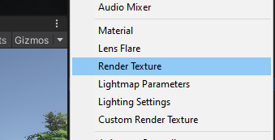

**1. Post Processing**
######Create New Object
;
- 후처리 기능
- Add Effect로 다양한 기능 추가

<br/>

######Add Component in Camera
;
- set 'Volume Layer' into **postProcessing**

<br/>

######Region of PostProcess
;
- If 'Is Global' in PostProcessing object is checked, all area is affected.


<br/>
<br/>
<br/>

**2. Render Texture**


######Step.1
;
- Create Render Texture

<br/>

######Step.2
;
- Add Render Texture into the Camera Component

<br/>

**Extra Settings**
;
- shader : Unlit (very light)


;
- Flayer Layer : show flare(햇빛 효과)


**Tween**

1. MoveTo(30)
    - 30까지 이동(절대좌표)
2. Moveby(30)
    - 30만큼 이동
3. Move From(30)
    - 30(절대좌표)부터 현재 좌표까지 이동


######ITween
;
```cs
iTween.MoveTo(ufo1, iTween.Hash("y", 100, "time", 3.0f, "easetype", iTween.EaseType.easeOutElastic));
// y : 해당 y 좌표로
// time : 해당 시간동안
// easetype : 해당 타입으로
이동

-------------
// Create hash table 
Hashtable ht2 = new Hashtable();
ht2.Add("y", 100.0f);
ht2.Add("delay", 3.0f);
ht2.Add("time", 2.0f);
ht2.Add("easetype", iTween.EaseType.easeOutBounce);
```