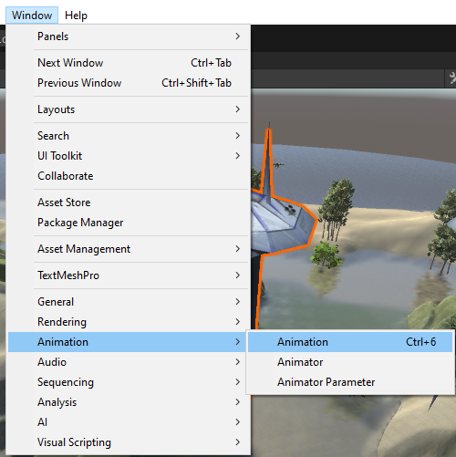
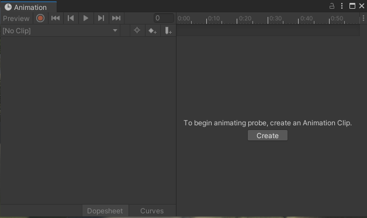
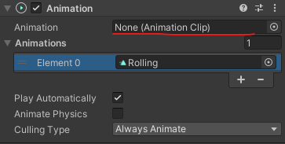
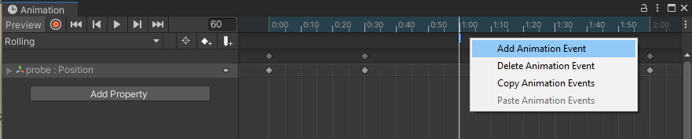
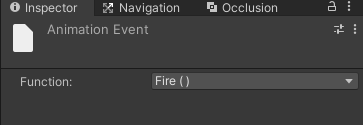
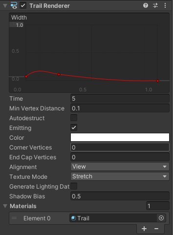

**1. Animation**
- 애니매이션을 생성 할 때 해당 오브젝트를 기준으로 만들면
애니매이셔 위치가 글로벌 좌표로 설정이됨.
- 빈 오브젝트를 생성하여 하위에 해당 오브젝트를 집어넣은 뒤 빈 오브젝트 기준으로 애니메이션을 생성 해야함.

 

###### Create Animation

 

###### Animation Setting

- create and set new animation

 

###### Drag Animation Clip

- add animation into animation component.

- 컴포넨트의 모든 속성들을 애니메이션에 recording 할 수있다.

 

**2. Animation Event**

- Click the Animation Clip in the following object, and create Animation Event.

 

- Choose the function you want to call.

 

**3. Trail**

