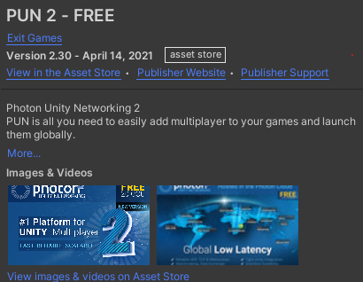
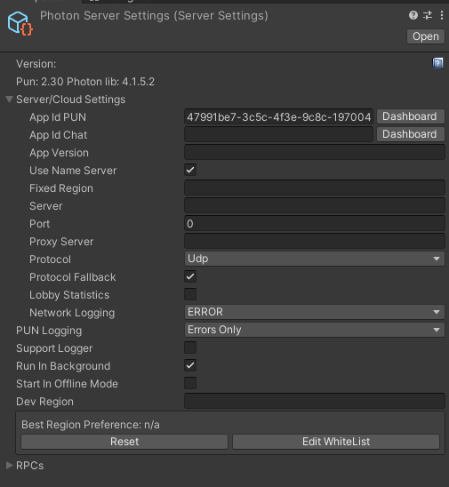

##1. Photon

**PUN - Asset store**
;

<br/>

**Photon Server Setting**

;
- fixed region : 지역 설정
- server : 개인 서버 입력용
- protocol (통신규약)
    - tcp : 데이터 전송의 정확성을 중요시 함.
    - udp : 전송위주(상대측이 데이터를 잘 받고 있는지 체크 x) 
- logging : 어떤 절차를 거치는지 표시해줌
- run in background : 한 컴퓨터에서 멀티 테스트를 할 때 켜놔야함.
- start in offline mode : 로컬 모드로 실행.
- dev region : 개발 할 때 테스트 할 지역서버.


<br/>

**Script**


```cs
public class PhotonManager : MonoBehaviourPunCallbacks
{
    private readonly string gameVersion = "v1.0";
    // 플레이어의 게임 버전이 다른 상태에서 만나게 되면 충돌이 발생할 수 있음.

    private string userId = "Yongjung";

    void Awake()
    {
        PhotonNetwork.AutomaticallySyncScene = true; // 방장이 scene을 loading을 하면 그 방안에 있는 유저들도 자동으로 scene을 loading 해줌

        PhotonNetwork.GameVersion = gameVersion;

        PhotonNetwork.NickName = userId;

        PhotonNetwork.ConnectUsingSettings(); //Photo server에 접속 (ping test 서버가 살아있는지 확인)
    }

    //Photon에 연결 되었을 경우 호출
    public override void OnConnectedToMaster()
    {
        Debug.Log("Connected to Photon.");


        //PhotonNetwork.JoinRandomRoom(); -> 랜덤한 방에 입장. (실패시 OnJoinRandomFailed())

        PhotonNetwork.JoinLobby(); //로비에 입장
    }

    public override void OnJoinedLobby()
    {
        Debug.Log("joined lobby");
    }

    // 랜덤한 방에 입장 실패시 호출
    public override void OnJoinRandomFailed(short returnCode, string message)
    {
        Debug.Log($"code={returnCode}, msg={message}");

        RoomOptions ro = new RoomOptions();
        ro.IsOpen = true;
        ro.IsVisible = true;
        ro.MaxPlayers = 30;

        PhotonNetwork.CreateRoom("My Room", ro); // 방 생성.
    }

    // 방 생성시 호출
    public override void OnCreatedRoom()
    {
        Debug.Log("Room Created");
    }

    // 방 입장시 호출
    public override void OnJoinedRoom()
    {
        // PhotonNetwork.Instantiate("Tank", new Vector3(0,5,0), Quaternion.identity, 0);  방에 접속되어 있는 모든 플레이어에 동일하게 Instantiate.


        /*
        방장일 경우 :
        새로운 Scene을 Load.
        */
        if(PhotonNetwork.IsMasterClient)
        {
            PhotonNetwork.LoadLevel("BattleField");
        }
    }

    //Button click
    public void OnLoginClick()
    {
        PhotonNetwork.JoinRandomRoom(); //랜덤한 방에 입장(방이 없을 경우 OnJoinRoomFail 호출)
    }
}
```

```cs
pv.RPC("Fire", RpcTarget.All, null); 

RPC : remote procedure call
다른 pc에 있는 함수를 호출함.

```