## Vuforia

#### 0. Import

- import Vuforia into Unity
        (Vuforia.developer.com -> Download menu)

---

#### 1. vuforia homepage ->license 발급
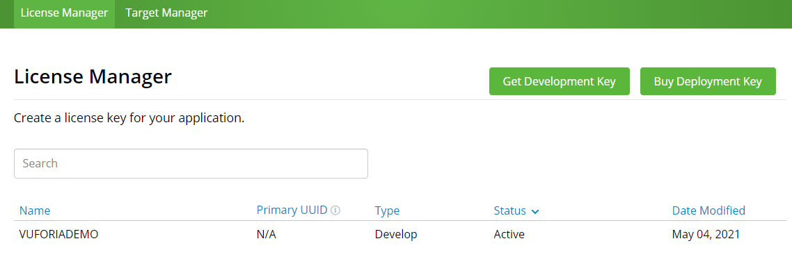
 

---

 

#### 2. Add Data base
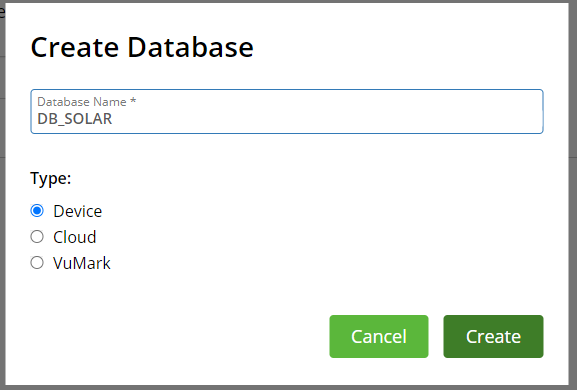

---

 

#### 3.  Add Target

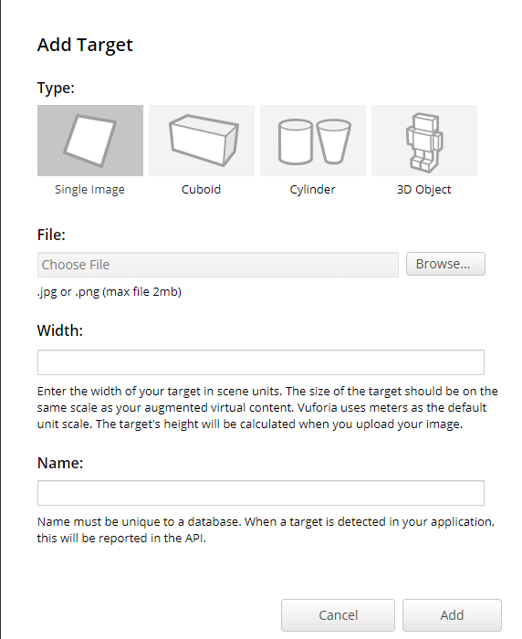

---

#### Setting
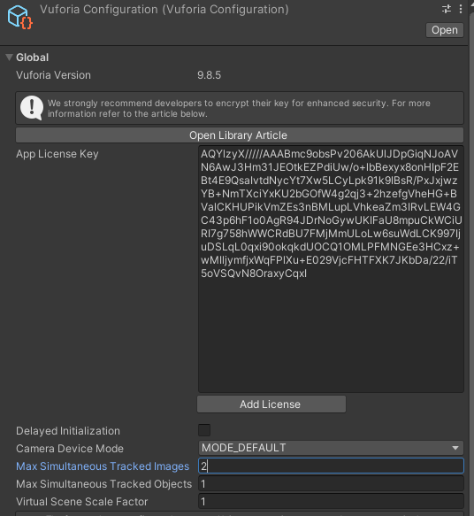
- Add Licnse key
- Set max simultaneous .. : 동시에 traking 할 값.

**Component**

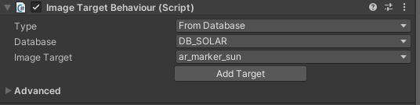

- component setting

**GameObject**
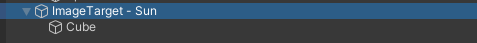

- 타겟 발견시 image target 하위 폴더에 있는 물체들을 enable 시킴

### Animation

**Blend Tree**

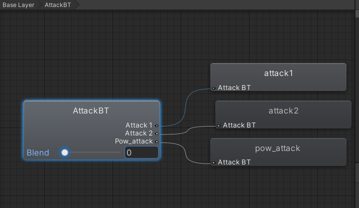
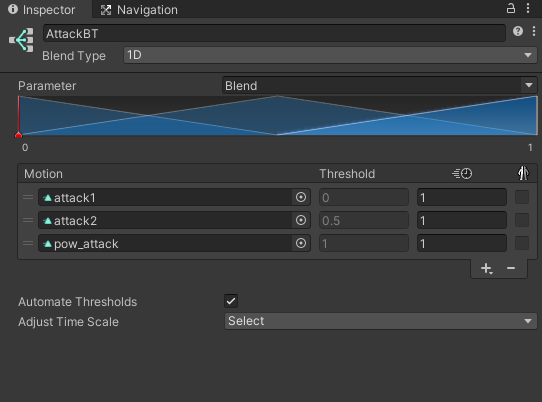

#### AR CORE
**import**
1. XR Legacy Input Helpers
com.unity.xr.legacyinputhelpers

2. Multiplayer HLAPI
com.unity.multiplayer-hlapi

#### Point Cloud
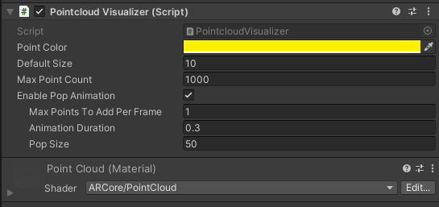
 - create cube
 - set shader as ARcore/PointCloud
 - add component(pointcloud visual visualizer)

#### Detecte Plane 
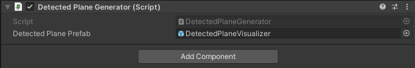
- create empty object
- pu detected Plane Prefab

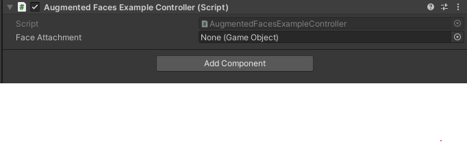

ar foundation
ar core 
ar kit face tracking

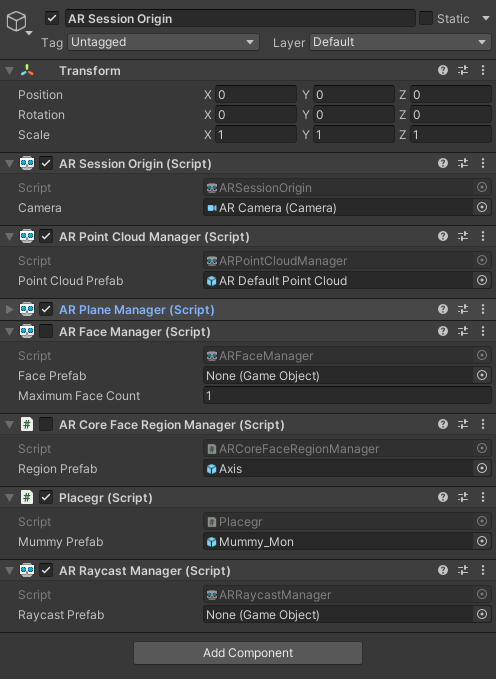

