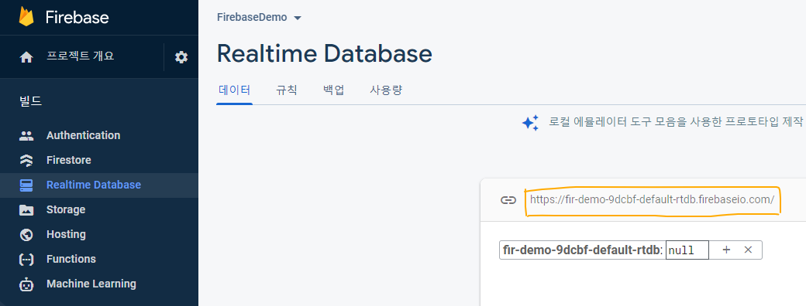
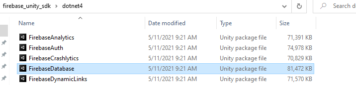
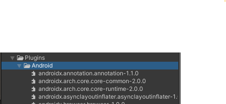

## Firebase

**1. 앱 권한 생성**

    1. firebase.google.com 접속
    2. Add Project
    3. Write package name (com.(유니티회사명).(앱이름))
    4. Download json file
    5. Download firebase SDK


</br>

**2. 데이터베이스 생성**



     Yellow Box : Database URI


</br>

**3. Import Package And Json**




    1. import firebase package 




    2. import json file on the following location 


</br>

**4. Unity Script**

```cs
//firebse namespace
using Firebase;
using Firebase.Database;


//Firebase에 저장 할 데이터 구조
public class User
{
    public string userName;
    public int gold;

    public User(string _userName, int _gold)
    {
        this.userName = _userName;
        this.gold = _gold;
    }
}


public class FBManager : MonoBehaviour
{
    //저장할 데이터 ui 항목
    public InputField userName;
    public InputField gold;

    // firebase reference 전역선언
    private DatabaseReference reference;

    // firebase Database 고유주소(URI)
    private readonly string uri = "https://fir-demo-9dcbf-default-rtdb.firebaseio.com/";
    
    void Awake()
    {
        //Create App info 
        AppOptions options = new AppOptions();
        options.DatabaseUrl = new System.Uri(uri);

        //Create App
        FirebaseApp app = FirebaseApp.Create(options);

    }

    void Start()
    {
        reference = FirebaseDatabase.DefaultInstance.RootReference;
        //RootReference : 데이터베이스 root 밑에 생성된다.
    }
}


```